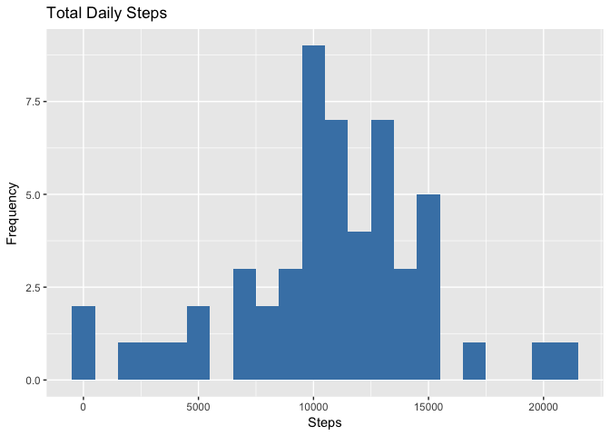
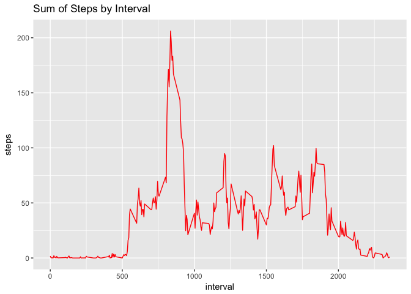
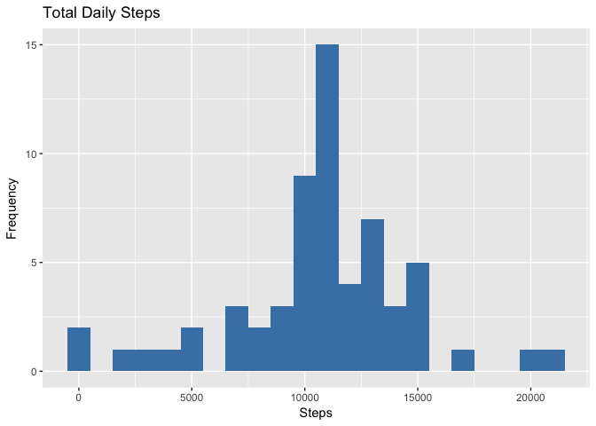
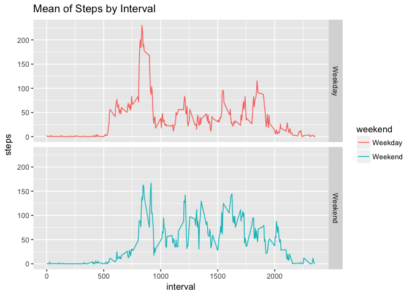

## Loading and preprocessing the data
### Show any code that is needed to

* Load the data (i.e. read.csv())


```r
# Load the graphics library for plotting
library(ggplot2)

# Unzip the activity data archive
unzip("activity.zip")

# Read base data into a data frame.
baseData <- read.csv("activity.csv")
```

To see some information about the data

```r
summary(baseData)
```

```
##      steps                date          interval     
##  Min.   :  0.00   2012-10-01:  288   Min.   :   0.0  
##  1st Qu.:  0.00   2012-10-02:  288   1st Qu.: 588.8  
##  Median :  0.00   2012-10-03:  288   Median :1177.5  
##  Mean   : 37.38   2012-10-04:  288   Mean   :1177.5  
##  3rd Qu.: 12.00   2012-10-05:  288   3rd Qu.:1766.2  
##  Max.   :806.00   2012-10-06:  288   Max.   :2355.0  
##  NA's   :2304     (Other)   :15840
```

To see a few lines of the data

```r
head(baseData)
```

```
##   steps       date interval
## 1    NA 2012-10-01        0
## 2    NA 2012-10-01        5
## 3    NA 2012-10-01       10
## 4    NA 2012-10-01       15
## 5    NA 2012-10-01       20
## 6    NA 2012-10-01       25
```

* Process/transform the data (if necessary) into a format suitable for your analysis
Change data type and remove NAs(if any)

```r
# change date type to date class 
baseData$date <- as.Date(as.character(baseData$date))
# create NA logical vector
baseDataNA <- is.na(baseData$steps)
# create clean base for later mean calculations
cleanBase <- baseData[!baseDataNA,]
```

## What is mean total number of steps taken per day?

* Calculate the total number of steps taken per day


```r
# Aggregate steps per day
SummedDataByDay <- aggregate(baseData$steps, by=list(baseData$date), sum)
# Rename column names
names(SummedDataByDay)[1] ="date"
names(SummedDataByDay)[2] ="totalsteps"
# Step count for the first 10 Days
head(SummedDataByDay,10)
```

```
##          date totalsteps
## 1  2012-10-01         NA
## 2  2012-10-02        126
## 3  2012-10-03      11352
## 4  2012-10-04      12116
## 5  2012-10-05      13294
## 6  2012-10-06      15420
## 7  2012-10-07      11015
## 8  2012-10-08         NA
## 9  2012-10-09      12811
## 10 2012-10-10       9900
```

* If you do not understand the difference between a histogram and a barplot, research the difference between them. Make a histogram of the total number of steps taken each day


```r
# Plot using ggplot
ggplot(SummedDataByDay, aes(x = totalsteps)) +
  geom_histogram(fill = "steelblue", binwidth=1000) +
    labs(title = "Total Daily Steps", x = "Steps", y = "Frequency")
```

```
## Warning: Removed 8 rows containing non-finite values (stat_bin).
```

<!-- -->

* Calculate and report the mean and median of the total number of steps taken per day

Let's calculate the mean 

```r
# Mean of steps taken per day
mean(SummedDataByDay$totalsteps,na.rm=TRUE)
```

```
## [1] 10766.19
```
Let's calculate the median 

```r
#median of steps taken per day
median(SummedDataByDay$totalsteps,na.rm=TRUE)
```

```
## [1] 10765
```

## What is the average daily activity pattern?
* Make a time series plot of the 5-minute interval (x-axis) and the average number of steps taken, averaged across all days (y-axis)

```r
nonNASubset <- baseData[!baseDataNA,]
MeanDataByInterval <- aggregate(nonNASubset$steps, by=list(nonNASubset$interval), mean)
# Rename column names
names(MeanDataByInterval)[1] ="interval"
names(MeanDataByInterval)[2] ="steps"

ggplot(MeanDataByInterval, aes(x = interval, y=steps)) +
  labs(title = "Sum of Steps by Interval", x = "interval", y = "steps")+
  geom_line(color="red") 
```

<!-- -->

* Which 5-minute interval, on average across all the days in the dataset, contains the maximum number of steps?


```r
maxInterval <- MeanDataByInterval[which.max(MeanDataByInterval$steps),]
maxInterval
```

```
##     interval    steps
## 104      835 206.1698
```

## Imputing missing values
* Calculate and report the total number of missing values in the dataset (i.e. the total number of rows with NAs)

```r
# generate listing of NA's
missingVals <- sum(baseDataNA)
missingVals
```

```
## [1] 2304
```

* Devise a strategy for filling in all of the missing values in the dataset. The strategy does not need to be sophisticated. For example, you could use the mean/median for that day, or the mean for that 5-minute interval, etc.

The strategy is to use mean interval steps from Mean Steps for that interval.

* Create a new dataset that is equal to the original dataset but with the missing data filled in.

```r
# Create another copy of existing dataset that will be the new dataset
baseData2 <- baseData
missingData <- is.na(baseData2$steps)
meanVals <- tapply(cleanBase$steps, cleanBase$interval, mean, na.rm=TRUE, simplify=TRUE)
baseData2$steps[missingData] <- meanVals[as.character(baseData2$interval[missingData])]
```
Check the count of NAs in original dataset

```r
sum(missingData)
```

```
## [1] 2304
```
Check the count of NAs in new dataset

```r
sum(is.na(baseData2$steps))
```

```
## [1] 0
```

* Make a histogram of the total number of steps taken each day and Calculate and report the mean and median total number of steps taken per day. 

```r
FullSummedDataByDay <- aggregate(baseData2$steps, by=list(baseData2$date), sum)
names(FullSummedDataByDay)[1] ="date"
names(FullSummedDataByDay)[2] ="totalsteps"
head(FullSummedDataByDay,10)
```

```
##          date totalsteps
## 1  2012-10-01   10766.19
## 2  2012-10-02     126.00
## 3  2012-10-03   11352.00
## 4  2012-10-04   12116.00
## 5  2012-10-05   13294.00
## 6  2012-10-06   15420.00
## 7  2012-10-07   11015.00
## 8  2012-10-08   10766.19
## 9  2012-10-09   12811.00
## 10 2012-10-10    9900.00
```
Histogram

```r
ggplot(FullSummedDataByDay, aes(x = totalsteps)) +
  geom_histogram(fill = "steelblue", binwidth=1000) +
  labs(title = "Total Daily Steps", x = "Steps", y = "Frequency")
```

<!-- -->

* Do these values differ from the estimates from the first part of the assignment? 

Mean on Old Data

```r
mean(SummedDataByDay$totalsteps,na.rm=TRUE)
```

```
## [1] 10766.19
```
Mean on New Data

```r
mean(FullSummedDataByDay$totalsteps)
```

```
## [1] 10766.19
```
Median on Old Data

```r
median(SummedDataByDay$totalsteps,na.rm=TRUE)
```

```
## [1] 10765
```
Median on New Data

```r
median(FullSummedDataByDay$totalsteps)
```

```
## [1] 10766.19
```

* What is the impact of imputing missing data on the estimates of the total daily number of steps?

The impact of imputing missing data on the estimates of the total daily number of steps seems to push overall data towards the mean.

## Are there differences in activity patterns between weekdays and weekends?


```r
baseData2$weekday <- weekdays(baseData2$date)
baseData2$weekend <- ifelse (baseData2$weekday == "Saturday" | baseData2$weekday == "Sunday", "Weekend", "Weekday")
head(baseData2,5)
```

```
##       steps       date interval weekday weekend
## 1 1.7169811 2012-10-01        0  Monday Weekday
## 2 0.3396226 2012-10-01        5  Monday Weekday
## 3 0.1320755 2012-10-01       10  Monday Weekday
## 4 0.1509434 2012-10-01       15  Monday Weekday
## 5 0.0754717 2012-10-01       20  Monday Weekday
```


```r
MeanDataWeekendWeekday <- aggregate(baseData2$steps, by=list(baseData2$weekend, baseData2$interval), mean)

names(MeanDataWeekendWeekday)[1] ="weekend"
names(MeanDataWeekendWeekday)[2] ="interval"
names(MeanDataWeekendWeekday)[3] ="steps"

ggplot(MeanDataWeekendWeekday, aes(x = interval, y=steps, color=weekend)) +
  geom_line() +
  facet_grid(weekend ~ .) +
  labs(title = "Mean of Steps by Interval", x = "interval", y = "steps")
```

<!-- -->


